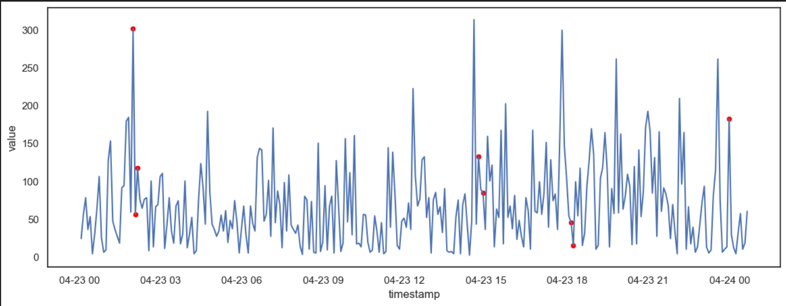
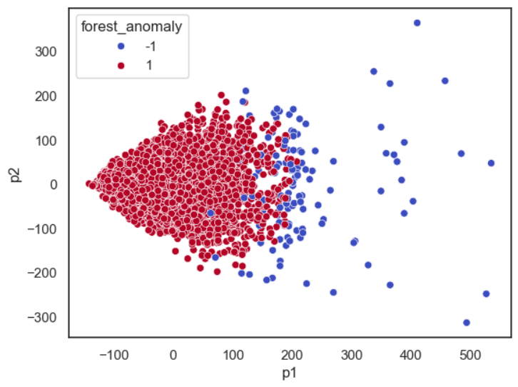

---

# AnomalyDetector: Time Series Anomaly Detection 🕵️‍♂️

AnomalyDetector is a Python-based project that detects anomalies in time series data using the **Isolation Forest** algorithm. It is designed to analyze time-stamped data, identify unusual patterns, and visualize the results. This project is ideal for monitoring and analyzing metrics such as server requests, cloudwatch data, or any time series dataset.

---

## Features ✨

- **Time Series Analysis**: Analyzes time-stamped data to detect anomalies.
- **Isolation Forest Algorithm**: Uses the Isolation Forest algorithm for unsupervised anomaly detection.
- **Visualization**: Provides clear visualizations of the time series data and detected anomalies.
- **Customizable**: Easily adjust the window size and contamination parameter for different datasets.

---

## Table of Contents

1. [Installation](#installation)
2. [Usage](#usage)
3. [Dataset](#dataset)
4. [Methodology](#methodology)
5. [Visualization](#visualization)
6. [Contributing](#contributing)
7. [License](#license)

---

## Installation 🛠️

### Prerequisites

- Python 3.7 or higher
- Required Python libraries (listed in `requirements.txt`)

### Steps

1. Clone the repository:
   ```bash
   git clone https://github.com/sedwna/detecting-anomalies-in-AWS-CloudWatch-data.git
   ```

2. Install dependencies:
   ```bash
   pip install -r requirements.txt
   ```

---

## Usage 🚀

### Running the Anomaly Detector

1. Place your dataset in the project directory (or use the provided dataset from Numenta Anomaly Benchmark).
2. Update the dataset path in the script if necessary:
   ```python
   df = pd.read_csv("../data/elb_request_count_8c0756.csv")
   ```
3. Run the notebook:
   ```bash
   python Isolation_Forest.py
   ```

### Example Output

The script will:
1. Load and preprocess the time series data.
2. Detect anomalies using the Isolation Forest algorithm.
3. Generate visualizations of the time series data and detected anomalies.

---

## Dataset 📊

The dataset used in this project is from the **Numenta Anomaly Benchmark (NAB)**. Specifically, it uses the `realAWSCloudwatch/elb_request_count_8c0756.csv` file, which contains time-stamped request counts from an AWS Elastic Load Balancer.

You can download the dataset from the [NAB GitHub repository](https://github.com/numenta/NAB/tree/master/data/realAWSCloudwatch).

---

## Methodology 🧠

### Steps

1. **Data Preprocessing**:
   - Convert the `timestamp` column to datetime format.
   - Create lagged features for the time series data.

2. **Anomaly Detection**:
   - Use the **Isolation Forest** algorithm to detect anomalies.
   - Adjust the `contamination` parameter to control the sensitivity of the detector.

3. **Visualization**:
   - Plot the time series data.
   - Highlight detected anomalies in red.

---

## Visualization 📈

The project generates the following visualizations:

1. **Time Series Plot**:
   - A line plot of the time series data.
   - Anomalies are highlighted with red dots.

2. **Anomaly Distribution**:
   - A histogram showing the distribution of normal vs. anomalous data points.

### Example Plots

  
*Time series data with anomalies highlighted in red.*

  
*Distribution of normal vs. anomalous data points.*

---

## Contributing 🤝

We welcome contributions to this project! If you'd like to contribute, please follow these steps:

1. Fork the repository.
2. Create a new branch (`git checkout -b feature/YourFeatureName`).
3. Commit your changes (`git commit -m 'Add some feature'`).
4. Push your changes to your fork (`git push origin feature/YourFeatureName`).
5. Open a Pull Request.

---

## License 📜

This project is licensed under the **MIT License**. See the [LICENSE](https://github.com/numenta/NAB/tree/master/data/realAWSCloudwatch) file for details.

---

## Acknowledgments 🙏

- **Numenta**: For providing the Numenta Anomaly Benchmark (NAB) dataset.
- **Scikit-learn**: For the Isolation Forest implementation.
- **Seaborn and Matplotlib**: For data visualization.

---

## Contact 📧

For questions or feedback, feel free to reach out:
- **Email**: [sajaddehqan2002@gmail.com]
- **GitHub**: [[My GitHub Profile](https://github.com/sedwna)]


---
